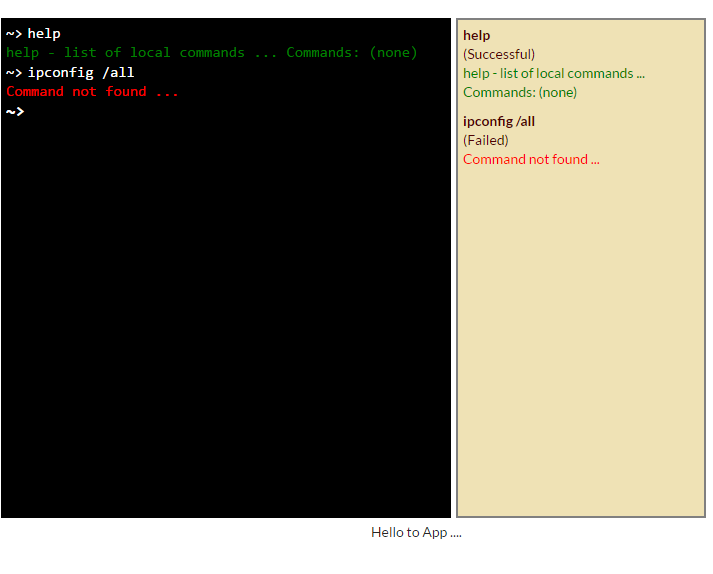

<p align="center">
  
</p>

# Angular 2 RxJS Command Line Manager

> An Angular 2 chat app using [Angular 2](https://angular.io/), [RxJS](https://github.com/Reactive-Extensions/RxJS), [Webpack](https://webpack.github.io/), [TypeScript](http://www.typescriptlang.org/), Services, Injectables, [Karma](http://karma-runner.github.io/), Forms, [SCSS](http://sass-lang.com/), and [tslint](http://palantir.github.io/tslint/) by [Fabrizio Torelli](https://github.com/hellgate75)

This repo shows an example chat application using RxJS and Angular 2. The goal is to show how to use the Observables data architecture pattern within Angular 2. It also features:

* Webpack configuration with TypeScript, Karma, SCSS, and tslint
* Writing async components that work with RxJS
* How to write injectable services in Angular 2
* And much more

<p align="center">
  
</p>

## Quick start

```bash
# clone the repo
git clone https://github.com/hellgate75/angular2-commander.git

# change into the repo directory
cd angular2-commander

# install
npm install

# run
npm run go
```

Then visit [http://localhost:8080](http://localhost:8080) in your browser.

## Architecture

The app has three models:

* [`Command`](app/ts/model/base_models.ts#L14) - holds individual command line commands

And there are three services, one for each feature:

* [`CommandsService`](app/ts/services/CommandsService.ts) - manages streams of `Command`s
* [`HistoryService`](app/ts/services/HistoryService.ts) - manages history of executed `Command`s
* [`ExecutionService`](app/ts/services/ExecutionService.ts) - manages the execution of the current `Command`

There are also four components:

* [`Commander`](app/ts/components/Commander.ts#L107) - for the data entry of the commands (console) - top-level
* [`CommanderLine`](app/ts/components/Commander.ts#L31) - for the data entry of the commands (command line)
* [`Notification`](app/ts/components/Commander.ts#L84) - for the report of the previous commands execution
* [`History`](app/ts/components/History.ts) - history panel containing the history of commands - top-level

## Detailed Installation

**Step 1: Install Node.js from the [Node Website](http://nodejs.org/).**

We recommend Node version 4.1 or above. You can check your node version by running this:

```bash
$ node -v
vv4.1...
```

**Step 2: Install Dependencies**

```bash
npm install
```

## Running the App

```bash
npm run go
```

Then visit [http://localhost:8080](http://localhost:8080) in your browser.

## Running the Tests

You can run the unit tests with:

```bash
npm run test
```

## License
 [MIT](/LICENSE.md)
